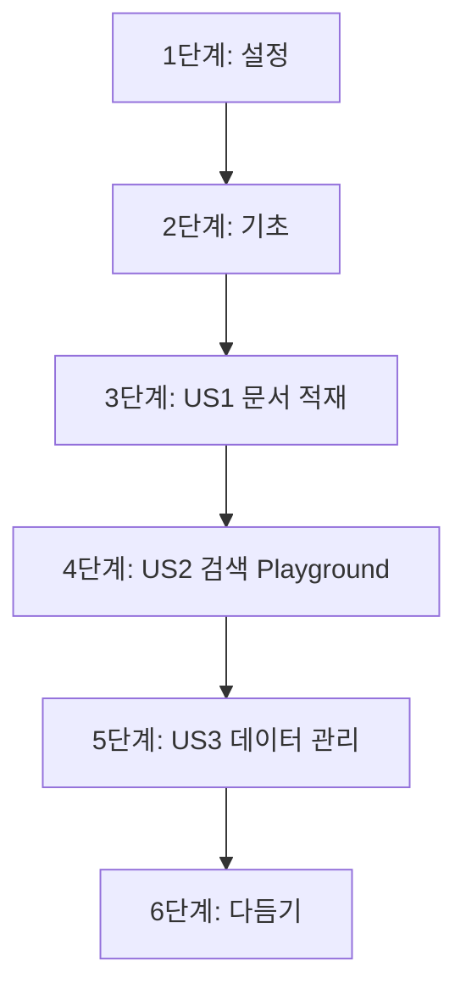

# 작업 목록: django-server-core

**기능 브랜치**: `002-django-server-core`
**설계 문서**: [plan.md](./plan.md), [spec.md](./spec.md), [data-model.md](./data-model.md)

## 구현 전략

- **MVP 우선**: 문서 적재(US1)와 기본 검색 Playground(US2)를 우선 구현하여 핵심 가치를 검증함.
- **점진적 배포**: 데이터 모델 및 인프라 설정 후, 독립적인 사용자 스토리별로 구현 및 테스트 진행.
- **레이아웃**: 백엔드 표준인 `src` 레이아웃을 준수하여 인프라와 비즈니스 로직을 격리함.

## 의존성 그래프

## 단계별 작업

### 1단계: 설정 (Setup)
**목표**: 독립적인 Django 개발 환경 및 인프라(DB) 구동 환경 구축

- [ ] T001 `django_server/pyproject.toml`에 Django 5.2, psycopg[binary], pgvector 등 필수 의존성 정의
- [ ] T002 [P] 저장소 루트 `docker-compose.yml`에 PostgreSQL 16 및 pgvector 확장 이미지 설정 추가
- [ ] T003 `django_server/src/` 디렉토리에 Django 프로젝트(`core`) 및 앱(`documents`) 초기화
- [ ] T004 `django_server/src/core/settings.py`에 PostgreSQL 연결 및 `pgvector` 확장 활성화 설정

### 2단계: 기초 (Foundational)
**목표**: 데이터 모델 정의 및 공통 서비스(임베딩, 청킹) 구현

- [ ] T005 [P] `django_server/src/documents/models.py`에 Document, Section, Chunk 모델 구현 (UUID PK, VectorField, `target_version` 속성 포함)
- [ ] T006 `django_server/src/documents/services/embedding.py`에 BAAI/bge-m3 모델 로드 및 벡터 생성 서비스 구현 (Singleton)
- [ ] T007 `django_server/src/documents/services/chunking.py`에 MarkdownHeaderTextSplitter 기반 청킹 및 코드 블록 보존 로직 구현 (짧은 문서 예외 처리 및 청크 상단 Title/URL 주입 포함)
- [ ] T008 [P] `django_server/tests/test_models.py`에 데이터 모델 무결성 테스트 작성

### 3단계: 사용자 스토리 1 - 문서 적재 자동화 (US1)
**목표**: 로컬 마크다운 파일을 파싱하여 벡터 DB에 Upsert하는 CLI 명령어 구현
**테스트 기준**: `manage.py ingest_docs` 실행 후 지정된 경로의 문서가 DB에 정확히 적재됨을 검증

- [ ] T009 [US1] `django_server/src/documents/management/commands/ingest_docs.py`에 CLI 명령어 프레임워크 및 인자 처리 구현
- [ ] T010 [US1] `ingest_docs.py`에 YAML Front Matter(`target_version` 포함) 파싱 및 문서 단위 트랜잭션(Atomic) 처리 로직 구현
- [ ] T011 [US1] 문서 적재 시 기존 데이터 삭제 후 재적재(Upsert)하는 클린업 로직 구현
- [ ] T012 [P] [US1] `django_server/tests/test_ingestion.py`에 다양한 마크다운 샘플(코드 블록 포함) 적재 테스트 작성

### 4단계: 사용자 스토리 2 - 검색 실험실 (US2)
**목표**: 코사인 유사도 기반 검색 API 및 Playground 웹 인터페이스 구현
**테스트 기준**: 자연어 질의 입력 시 유사도 점수와 함께 관련 청크가 1초 이내에 반환됨

- [ ] T013 [US2] `django_server/src/documents/services/search.py`에 pgvector 코사인 유사도 쿼리 및 필터(`target_version`, 카테고리) 로직 구현 (비동기 ORM 적극 활용)
- [ ] T014 [US2] `django_server/src/documents/views.py`에 Playground 메인 뷰 및 HTMX 검색 엔드포인트 구현 (async def 뷰 적용)
- [ ] T015 [US2] `django_server/src/documents/templates/playground/` 하위에 HTMX 기반 검색 UI 템플릿 작성
- [ ] T016 [P] [US2] `django_server/tests/test_search.py`에 벡터 검색 정확도 및 필터링 기능 테스트 작성

### 5단계: 사용자 스토리 3 - 데이터 및 품질 관리 (US3)
**목표**: Django Admin 커스터마이징 및 문서 상태 관리 기능 구현
**테스트 기준**: Admin에서 문서 비활성화 시 검색 결과에서 제외됨을 확인

- [ ] T017 [US3] `django_server/src/documents/admin.py`에 Document, Chunk 관리 화면 커스터마이징 (필터, 검색 기능 추가)
- [ ] T018 [US3] Admin 내에서 검색 결과와 원본 본문을 대조할 수 있는 품질 분석 링크/뷰 추가
- [ ] T019 [US3] `Document.status` 변경 로직 구현 및 검색 시 활성 상태 필터링 강제 적용

### 6단계: 다듬기 (Polish)
**목표**: 예외 처리 강화 및 최종 문서화

- [ ] T020 [P] 모든 서비스 로직에 Google Style Docstring(한국어) 작성 및 Ruff 린트 통과
- [ ] T021 적재 실패(임베딩 모델 Timeout 등) 시 프로세스를 안전하게 중단하고 `logs/ingest_error.log`에 에러 기록 및 관리자 알림(Django Messages) 구현
- [ ] T022 `django_server/src/quickstart.md`의 절차를 따라 최종 통합 테스트 수행 및 환경 설정 가이드 최신화

## 병렬 실행 예시

- **T001, T002**: 인프라와 의존성 설정을 동시에 진행 가능.
- **T005, T008**: 모델 정의와 무결성 테스트를 병렬로 작업 가능.
- **T012, T016**: 각 단계의 통합 테스트 작성을 구현과 병렬로 진행 가능.
