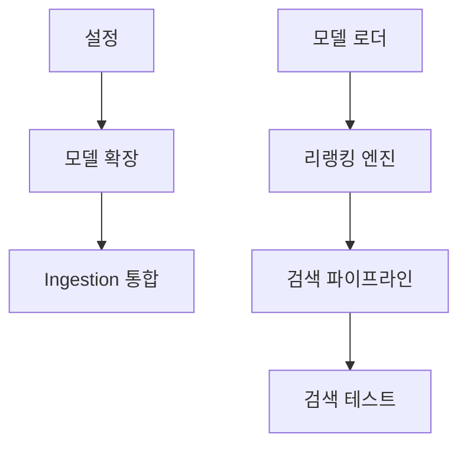

# 작업 목록 (Tasks): 고성능 하이브리드 검색 및 Late Interaction 리랭커 도입

**기능**: `005-optimize-search-rerank` | **날짜**: 2026-03-20
**명세서**: [spec.md](./spec.md) | **계획서**: [plan.md](./plan.md)

## 구현 전략

- **MVP 우선**: `gpahal/bge-m3-onnx-int8` 모델을 통한 쿼리 임베딩 및 MaxSim 연산 기반의 리랭킹 파이프라인을 먼저 구축하여 1.5초 지연 문제를 즉시 해결합니다.
- **점진적 배포**: `DocumentChunk` 모델 확장을 통해 기존 벡터 데이터는 유지하면서 압축된 멀티벡터 데이터를 추가 적재합니다.
- **ORM 현대화**: 검증된 Raw SQL 로직을 `django-paradedb` 기반의 선언적 ORM 코드로 전환하여 유지보수성을 확보합니다.

## 의존성 그래프

## 단계별 작업

### 1단계: 설정 (Setup)

- [X] T001 [P] `django_server/pyproject.toml`에 `django-paradedb~=0.4.0`, `onnxruntime`, `optimum`, `numpy` 의존성 추가 및 `uv sync` 실행
- [X] T002 [P] `django_server/src/core/settings.py`에 `gpahal/bge-m3-onnx-int8` 모델 경로 및 ONNX 실행 옵션 설정

### 2단계: 기초 (Foundational)

- [X] T003 `django_server/src/documents/models.py`의 `Chunk` 모델에 `multi_vector_low_dim` (BinaryField) 필드 추가
- [X] T004 `django_server/src/manage.py makemigrations` 및 `migrate` 실행하여 DB 스키마 반영

### 3단계: [US1] 고성능 하이브리드 검색 및 리랭킹 (P1)

**목표**: Late Interaction 아키텍처를 도입하여 1초 이내의 고정밀 검색 결과 제공

- [X] T005 [US1] `django_server/src/documents/services/reranking.py` 신설 및 NumPy 기반의 벡터화된 MaxSim 연산(Mean MaxSim 정규화 및 0.3 임계값 필터링 포함) 구현
- [X] T006 [US1] `django_server/src/documents/services/embedding.py`를 수정하여 `gpahal/bge-m3-onnx-int8` 모델 로드 및 Dense/Multi-vector 동시 추출 로직 구현
- [X] T007 [US1] `django_server/src/documents/services/search.py`에 1차 하이브리드 검색 결과 상위 20개를 대상으로 하는 Late Interaction 리랭킹 파이프라인 통합 및 폴백 로직(FR-004) 구현
- [X] T008 [US1] `django_server/tests/test_search.py`에 1초 이내 응답 속도, 리랭킹 정밀도 및 search_django_knowledge 규격(SYS-002) 준수 검증 테스트 케이스 추가

### 4단계: [US2] 하이브리드 검색 관리 현대화 (P2)

**목표**: 기존 Raw SQL을 `django-paradedb` ORM으로 리팩토링하여 유지보수성 향상

- [X] T009 [US2] `django_server/src/documents/models.py`의 `Chunk` 모델 `Meta` 클래스에 `BM25Index` 정의 및 `ParadeDBManager` 설정
- [X] T010 [US2] `django_server/src/documents/services/search.py`의 `hybrid_search` 메서드를 `django-paradedb` ORM 스타일로 리팩토링 (Pre-filtering 적용)

### 마지막 단계: 다듬기 (Polish)

- [X] T011 `django_server/src/documents/management/commands/ingest_docs.py` 수정: 임베딩 시 128차원 축소 및 int8 양자화된 멀티벡터 생성/저장 로직 추가
- [X] T012 `uv run python src/manage.py ingest_docs --reindex` 실행하여 전체 문서에 대한 압축 멀티벡터 데이터 구축
- [X] T013 `django_server/src/documents/templates/playground/` 웹 UI 업데이트: 지연 시간(ms) 시각화 및 기존/신규 점수 비교 기능 보강
