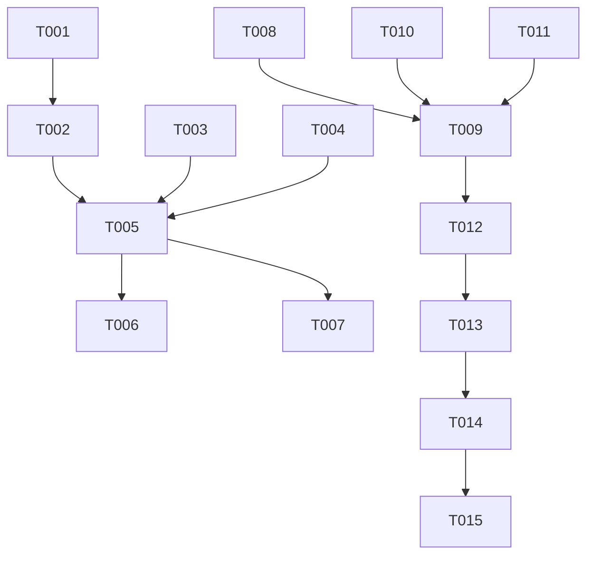

# 작업 목록: Django 5.2 공식 문서 웹 크롤링 및 마크다운 변환

**기능 이름**: `007-crawl-django-web` | **날짜**: 2026-03-24
**계획서**: `specs/007-crawl-django-web/plan.md`

## 1단계: 설정 (Setup)

- [ ] T001 `crawler/django52_crawler.py`에 `all`, `crawl`, `convert` 명령을 포함하는 기본 CLI 구조 및 인자 처리 구현
- [ ] T002 `crawler/django52_crawler.py` 내부에 `data-model.md`에 정의된 `CrawlerConfig` 및 `CrawlSession` 클래스 정의

## 2단계: 기초 (Foundational)

- [ ] T003 [P] `crawler/utils/storage.py`에 URL 경로를 로컬 디렉터리 계층으로 변환하고 파일을 저장/조회하는 기능 고도화
- [ ] T004 [P] `crawler/utils/scraper.py`에 URL 끝 슬래시(/) 정규화(수집 및 추출 링크 공통 적용) 및 경로 필터링 로직 추가

## 3단계: [US1] 웹 기반 문서 수집 (Crawl)

- [ ] T005 [US1] `crawler/django52_crawler.py`에 `asyncio.Queue`와 `Set[str]`을 사용한 재귀적 비동기 크롤링 엔진 구현
- [ ] T006 [US1] `crawler/django52_crawler.py`에 전체 수집 및 덮어쓰기 로직 구현: 매 실행 시 모든 대상 URL을 방문하여 최신 HTML로 로컬 파일을 업데이트 (FR-007, FR-017)
- [ ] T007 [US1] `crawler/django52_crawler.py`에 시작 전 출력 폴더 비우기 로직 구현: `--clear` 옵션 시 해당 단계의 출력 폴더(`temp` 또는 `data_sources`)를 삭제 후 재생성 (FR-018)

## 4단계: [US2] 본문 추출 및 마크다운 변환 (Convert)

- [ ] T008 [US2] `crawler/utils/converter.py`의 `extract_content`에서 Readability를 제거하고, 특정 크롤러에 종속되지 않도록 추출 대상(Selector)을 매개변수화하도록 리팩토링
- [ ] T009 [US2] `crawler/django52_crawler.py`의 `convert` 명령 구현: 전용 선택자(`#docs-content`)를 사용하여 마크다운 변환 및 저장 수행

## 5단계: [US3] 링크 보정 및 RAG 호환성 (Enhance)

- [ ] T010 [US3] `crawler/utils/converter.py`에 모든 `<a>` 및 `` 태그의 상대 경로를 `https://docs.djangoproject.com/en/5.2/` 기반 절대 URL로 변환하는 로직 구현
- [ ] T011 [US3] `crawler/utils/converter.py`의 `to_markdown` 함수가 하드코딩된 버전 대신 `target_version`을 매개변수로 받도록 수정하고 YAML 생성 로직 통합

## 6단계: 다듬기 및 검증 (Polish)

- [ ] T012 [P] `crawler/django52_crawler.py`의 수집 및 변환 각 단계에 `tqdm`을 사용한 실시간 진행률 표시줄 통합
- [ ] T013 `crawler/django52_crawler.py` 실행 종료 시 총 수집/변환 성공 및 실패 통계 요약 출력
- [ ] T014 [P] `crawler/tests/test_utils.py`를 작성하여 storage, scraper, converter의 핵심 유틸리티 함수(URL 정규화, 본문 추출, 절대 링크 및 이미지 보정)에 대한 단위 테스트 수행
- [ ] T015 [P] `crawler/tests/test_django52_crawler.py`를 작성하여 통합 테스트 수행 (기본 User-Agent 검증, 마크다운 링크 유효성 전수 검사 포함)

## 의존성 그래프 (Dependency Graph)

## 병렬 실행 예시

- **기술적 병렬**: T003(Storage)과 T004(Scraper)는 서로 독립적이므로 동시에 작업 가능
- **스토리별 병렬**: US1(수집) 로직과 US2/US3(변환) 로직의 유틸리티 고도화는 독립적으로 진행 가능

## 구현 전략

- **MVP 우선**: `https://docs.djangoproject.com/en/5.2/` 시작점과 `ref/models/` 경로 등 핵심 문서 10개 내외를 대상으로 전체 파이프라인(`all`)을 먼저 검증
- **점진적 배포**: 수집 엔진(US1)을 먼저 완성하여 HTML 저장을 확인한 후, 변환 정밀도(US2/US3)를 단계적으로 향상
- **데이터 보존**: `temp` 폴더의 HTML은 삭제하지 않고 영구 유지하여 변환 로직 수정 시 반복적인 서버 요청 방지
