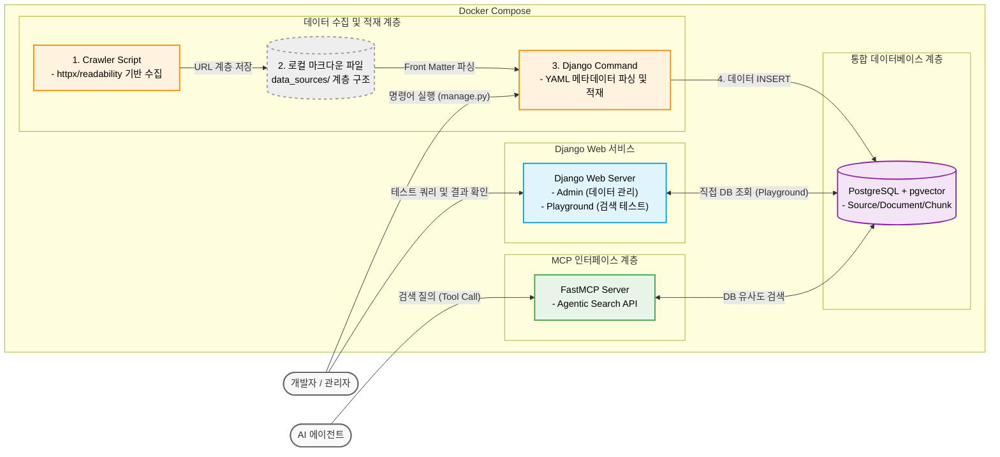

# 시스템 아키텍처 설계서 (Architecture Design)

본 시스템은 데이터 적재(Ingestion) 파트와 데이터 제공(Serving) 파트를 분리하여 인프라의 확장성과 무결성을 보장합니다.

## 1. 기술 스택 (Tech Stack)

* **Vector Database:** PostgreSQL + pgvector (차후 pg_vectorscale 검토)
* **Serving (MCP Server):** Python FastMCP (경량화 및 비동기 지원)
* **Ingestion & Testing (Web UI):** Django (내장 Auth/Admin 활용 및 **검색 테스트용 Playground 포함**)
* **Embedding Model:** BAAI/bge-m3 (Hugging Face 오픈소스, 1024 차원)
* **Infra:** Docker & Docker Compose (로컬 개발 환경 및 컨테이너 오케스트레이션)

## 2. 아키텍처 구성 및 데이터 흐름

### Phase 1 (MVP - 분리형 수동 파이프라인)
* **크롤러 스크립트:** 외부 웹/문서 다운로드 후 컨테이너 내 볼륨(로컬 파일)으로 저장.
* **Django Command:** `python manage.py ingest_docs` 등을 실행하여 로컬 파일을 읽고 마크다운 파싱/청킹 -> bge-m3 임베딩 -> PostgreSQL(pgvector)에 INSERT.
* **Playground (Django View):** 데이터 적재 후, 에이전트 없이 웹 브라우저에서 직접 질의(Query)를 입력하여 검색된 청크와 유사도 점수를 눈으로 확인하며 품질을 튜닝.

### Phase 2 (확장 - 보안 기반 웹 서비스)
* 관리자 Django Auth 세션 로그인 및 권한 검증.
* Django Admin을 통한 문서 다이렉트 업로드. 백그라운드 워커를 통한 비동기 파싱 및 안전한 DB 적재.
* **Data Serving (공통):** 에이전트 질의 -> FastMCP 서버 수신 -> DB 내 HNSW 인덱스 기반 고속 벡터 검색 -> 결과 JSON 반환.

## 3. 시스템 구성도

