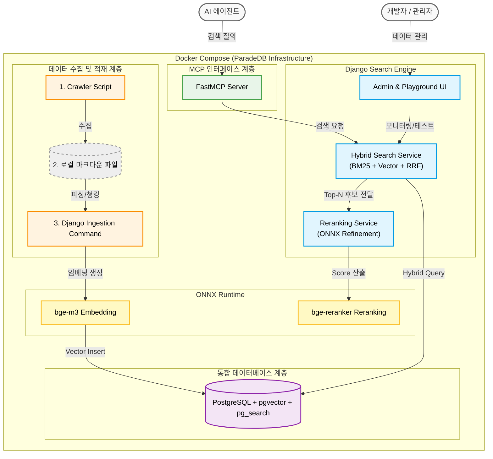

# 시스템 아키텍처 설계서 (Architecture Design)

본 시스템은 데이터 적재(Ingestion) 파트와 데이터 제공(Serving) 파트를 분리하여 인프라의 확장성과 무결성을 보장합니다.

## 1. 기술 스택 (Tech Stack)

* **Database:** PostgreSQL (ParadeDB: `pgvector` + `pg_search` 기본 포함)
* **Serving (MCP Server):** Python FastMCP (경량화 및 비동기 지원)
* **Ingestion & Testing (Web UI):** Django (하이브리드 검색 및 Rerank 파이프라인 엔진 포함)
* **Models & Runtime:**
    * **Embedding:** BAAI/bge-m3 (ONNX Runtime 가속, 1024 차원)
    * **Reranker:** BAAI/bge-reranker-v2-m3 (ONNX INT8 양자화)
    * **Runtime:** ONNX Runtime (CPU 환경 최적화)
* **Infra:** Docker & Docker Compose (ParadeDB 공식 이미지 활용)

## 2. 아키텍처 구성 및 데이터 흐름

### Phase 1 (MVP - 분리형 수동 파이프라인)
* **크롤러 스크립트:** 외부 웹/문서 다운로드 후 컨테이너 내 볼륨(로컬 파일)으로 저장.
* **Django Command:** `python manage.py ingest_docs` 등을 실행하여 로컬 파일을 읽고 마크다운 파싱/청킹 -> bge-m3 ONNX 임베딩 -> PostgreSQL(pgvector)에 INSERT.

### Phase 2 (하이브리드 검색 및 품질 강화)
* **Hybrid Retrieval:** 에이전트(또는 Playground) 질의 발생 시, BM25 키워드 검색과 벡터 유사도 검색을 병렬 수행.
* **RRF 통합:** 두 검색 결과의 순위를 RRF(Reciprocal Rank Fusion) 알고리즘을 통해 결합하여 상위 10개 후보 추출.
* **ONNX Reranking:** 추출된 후보군을 대상으로 Reranker 모델을 실행하여 질문과의 문맥적 관련성 재계산.
* **Playground:** 하이브리드 점수와 Rerank 점수를 시각적으로 비교 분석하고 품질 평가 지표(MRR 등) 산출.

### Phase 3 (Serving - MCP 인터페이스)
* **Data Serving:** 에이전트 질의 -> FastMCP 서버 수신 -> Django Search Service 호출(하이브리드 + Rerank) -> 최종 고품질 결과 반환.

## 3. 시스템 구성도

