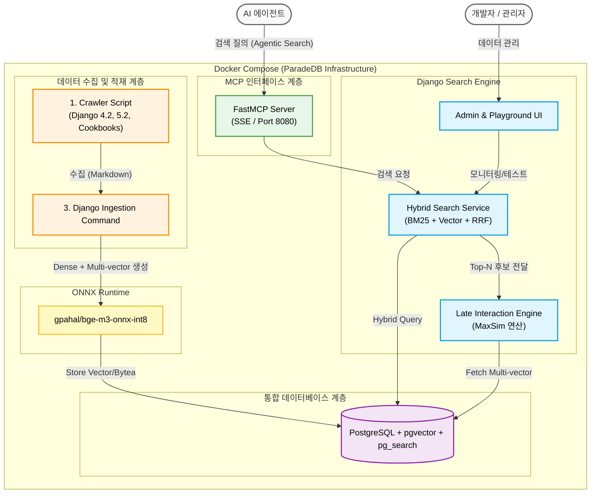

# 시스템 아키텍처 설계서 (Architecture Design)

> 💡 **설계 핵심 목표**
> 본 시스템은 데이터 적재(Ingestion) 파트와 데이터 제공(Serving) 파트를
> 물리적/논리적으로 분리하여 인프라의 확장성과 무결성을 보장합니다.

---

## 1. 기술 스택 (Tech Stack)

시스템을 구성하는 주요 기술과 프레임워크는 다음과 같습니다.

| 분류 | 기술 및 스택 | 역할 및 특징 |
| :--- | :--- | :--- |
| **Database** | PostgreSQL (ParadeDB) | `pgvector`와 `pg_search`가 기본 포함된 강력한 벡터 검색 DB |
| **Serving** | Python FastMCP | AI 에이전트 연동을 위한 경량화 및 비동기 지원 MCP 서버 (SSE 전송 방식) |
| **Ingestion & UI** | Django 5.2 | 하이브리드 검색 및 Rerank 엔진, 수집 파이프라인 관리 |
| **Infra** | Docker & Docker Compose | ParadeDB 공식 이미지 활용 및 컨테이너 기반 독립 환경 구성 |

**AI 모델 및 런타임 (Models & Runtime)**
*   **Embedding & Reranking:** **`gpahal/bge-m3-onnx-int8`** (단일 모델 통합)
*   **Optimization:** **Late Interaction (MaxSim)** 아키텍처 적용
*   **Runtime:** ONNX Runtime (순수 CPU 환경 최적화)

---

## 2. 아키텍처 구성 및 데이터 흐름

시스템 구축은 MVP부터 고도화 단계까지 3단계(Phase)를 거쳐 완성되었습니다.

### Phase 1: MVP (분리형 수동 파이프라인)
*   **크롤러 스크립트:** Django 공식 문서(4.2, 5.2) 및 Cookbook 등 외부 웹 소스를 재귀적으로 크롤링하여 HTML을 다운로드하고, 본문을 추출하여 마크다운으로 변환 후 로컬 저장소에 저장합니다.
*   **Django Command:** 변환된 마크다운을 읽어 파싱 및 청킹을 수행하고, `int8` ONNX 모델로 임베딩을 생성하여 PostgreSQL에 저장합니다.

### Phase 2: 검색 품질 고도화 (하이브리드 & Late Interaction)
*   **Hybrid Retrieval:** `django-paradedb`를 통해 BM25와 1,024차원 Dense 벡터 검색을 결합한 RRF 순위를 산출합니다.
*   **Late Interaction Reranking:**
    *   인제션 시점에 **128차원으로 압축된 멀티 벡터**를 DB에 사전 저장합니다.
    *   검색 시 질문의 멀티 벡터와 DB의 벡터 간 **MaxSim 연산**을 수행하여 정밀한 최종 순위를 도출합니다.
*   **성능 달성:** 실시간 모델 추론 오버헤드를 제거하여 1.5초 지연을 **0.3초 수준**으로 개선했습니다.

### Phase 3: 데이터 제공 (Serving - MCP 인터페이스) - **완료**
*   **FastMCP Serving:** `mcp_server/` 폴더 내의 독립적인 서버가 **SSE(Server-Sent Events)** 방식으로 실행됩니다.
*   **Agentic Search:** 도구 설명(Description)에 LLM을 위한 단계적 탐색 지침을 포함하여 에이전트가 스스로 검색 전략을 최적화하도록 유도합니다.
*   **Data Serving:** FastMCP 서버가 Django Search Service를 직접 호출하여 최종 검색 결과를 에이전트에게 반환합니다.

---

## 3. 시스템 구성도

